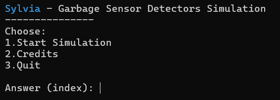
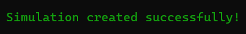
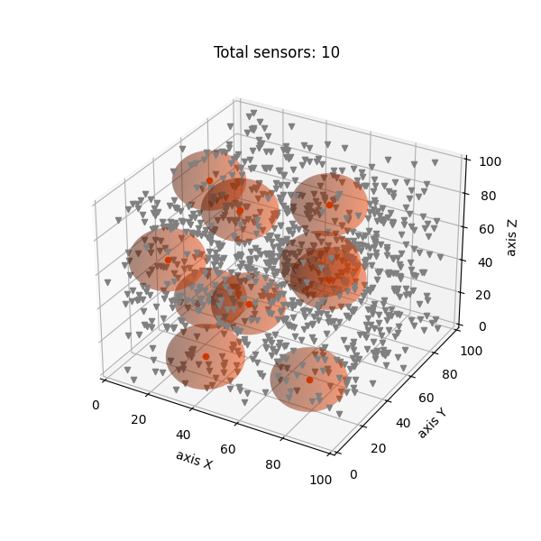
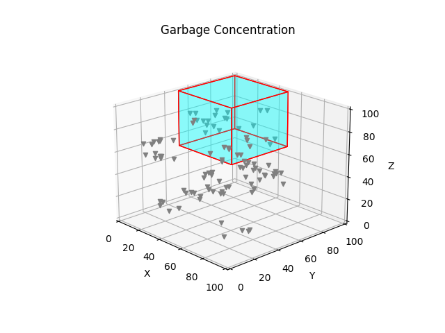

# Global Solution - Blue Future 🌊

`A "Economia Azul"` busca assegurar que as atividades humanas nos oceanos sejam ecologicamente responsáveis, socialmente inclusivas e economicamente viáveis a longo prazo. Isso inclui a adoção de práticas de **gestão ambiental**, a utilização de tecnologias inovadoras e a colaboração entre governos, empresas e comunidades locais. 

Atualmente, os oceanos enfrentam desafios críticos como a destruição de habitats, poluição e mudanças climáticas, impactando tanto os ecossistemas marinhos quanto a economia global.

## 1. Dynamic Programming 👾

`A programação dinâmica` é uma técnica de otimização usada para
resolver problemas que podem ser divididos em subproblemas
sobrepostos e cujas soluções podem ser armazenadas e
reutilizadas. 

Nos problemas relacionados aos **oceanos**, a
programação dinâmica pode ser aplicada em diversas áreas para encontrar soluções eficientes e ótimas. 

## 2. Alocação de Sensores de lixo 🗑️

### 2.1. Monitoramento de Poluição Oceânica

`Redes de Sensores Inteligentes`: Projeto de redes de sensores inteligentes que utilizam técnicas de programação dinâmica para otimizar a alocação de sensores subaquáticos e a coleta de dados sobre a poluição oceânica. Isso permite identificar áreas críticas de poluição e priorizar ações de monitoramento e resposta.

## 3. Simulação 💻

`Esta simulação` visa otimizar a alocação de sensores para detecção de resíduos em um ambiente cúbico multidimensional. 

A metodologia envolve a alocação estratégica de *x* sensores com raio de detecção r dentro de um cubo de dimensões *n*. A efetividade da alocação é avaliada pela detecção de um conjunto aleatório de *y* resíduos distribuídos no cubo. A simulação fornece insights sobre a relação entre a quantidade de sensores, seu raio de detecção e a taxa de detecção de resíduos, possibilitando a otimização da **alocação de sensores em cenários reais** de coleta de lixo ou monitoramento ambiental. 

A simulação pode ser expandida para incorporar diferentes tipos de sensores e modelos de distribuição de resíduos. 

## 4. Pré-Requisitos ⚙️

- Python
- Arquivos base
- Prompt de comando

### 4.1 Bibliotecas

```bash
  pip install colorama numpy pygame matplotlib
```

## 5. Execução 🏃

No prompt de comando, dentro da pasta com os arquivos, execute o seguinte comando para iniciar o sistema:

```bash
  py main.py
```

### 5.1. Início
Em seguida, será apresentado o sistema. O usuário deverá informar qual será sua próxima ação. Podemos escolher entre sair do sistema, ver os créditos ⭐ ou iniciar a simulação. 



### 5.2. Criação da simulação
Para criar a simulação, o usuário terá que escolher entre usar o valores padrões ou informar seus própios parâmetros. Então deverá, após uns segundos, aparecer uma mensagem de sucesso.



### 5.3. Visualização 
Com a simulação criada o usuário poderá optar por visualizar a animação da renderização da simulação criada. Para retornar ao sistema a aba da renderização precisa ser fechada.

**Exemplo de uma simulação:**



### 5.4. Análise do lixo detectado
Outra opção que o usuário terá é a de receber a análise dos dados de lixos detectados na simulação.

Caso opte pela análise, o usuário deverá informar se deseja visualizar a renderização da área de concentração de lixos detectados, e precisará fechar a nova aba para retornar ao sistema.

**Exemplo da área de concentração de lixo:**




## 6. Por de trás dos panos 🧠

### 6.1. Cálculo da esfera de leitura dos sensores

Cada sensor possui uma esfera que representa sua área de leitura, e para sabermos as dimensões e malha desta esfera nós nos baseamos na seção da **Wikipedia** *Spherical coordinate system* [2] que fundamenta a lógica dos cálculos. 

### 6.2. Cálculo da distância de dois pontos em um espaço tridimensional

Ao simular o comportamento de um ambiente real, trabalhamos em um espaço tridimensional. Com isso, se faz nescessário sabermos calcular a distância de dois pontos contidos neste espaço de três dimensões. 

O artigo *3 Dimensions - Distance Between Two Points* [1] explica em detalhes a razão do cáculo de distância ser da seguinte maneira:  

$distancia = \sqrt{(x_2 - x_1)^2 + (y_2 - y_1)^2 + (z_2 - z_1)^2} $

### 6.3. Cálculo para verificação de colisão de duas esferas

Sabermos se um sensor está lendo a mesma área de outro sensor é fundamental para o algoritmo de alocação de sensores. Por isso é nescessário construir um cálculo para verificação de colisão entre duas esferas.

Então, a partir da informação da distância de dois objetos, podemos verificar se duas esferas estão ocupando o mesmo espaço. 

Para isso, assumimos que há uma colisão entre uma esfera $a$ de raio $r_1$ e uma esfera $b$ de raio $r_2$, em que $distancia(a,b) ≤ r_1 + r_2$ .

### 6.4. Alocação de sensores

`O algortimo consiste, a partir de um coodenada, na dispersão de um sensor em um eixo aleatoriamente escolhido. A coordenada é atualizada a cada iteração que obteve sucesso na alocação.`

Assumindo a coordenada inicial de $x=0$, $y=0$ e $z=0$, e para cada nova iteração $value$ será o valor atual de um eixo aleatoriamente escolhido.

Para conseguirmos o valor da nova coordenada precisaremos calcular o $Step$, o valor de quanto o próximo sensor será deslocado. 

**Estes cálculos se dão da seguinte maneira**:

**se** $value ≤ \frac{size}{2}$

{ $Step ∈ Z | raio ≤ Step ≤ size-value$ } 

$NovaCoordenada = value + Step$ 

OU

**se** $value > \frac{size}{2}$

{ $Step ∈ Z | raio ≤ Step ≤ value$ } 

$NovaCoordenada = value - Step$ 

**Caso não haja colisões** na nova coordenada, o sensor é alocado e a coordenada atual será igual à nova coordenada. Reinciando o processo até que haja o número correto de sensores.

## 7. Referências 📖

> [1] [3 Dimensions - Distance Between Two Points](https://unacademy.com/content/nda/study-material/mathematics/analytical-geometry-three-dimensions-distance-between-two-points/#:~:text=Similarly%2C%20to%20calculate%20the%20distance,between%20two%20points%20is%20required.&text=PQ%20%3D%20d%20%3D%20%E2%88%9A%20%5B(x,%E2%80%93%20z1)2%5D.)

> [2] [Wikipedia - Spherical coordinate system](https://en.wikipedia.org/wiki/Spherical_coordinate_system)

## 8. Autores 🚀

- [@daviguerra05](https://github.com/daviguerra05)
- [@ruiasiqueira](https://github.com/ruiasiqueira)
- [@dejesuscaua](https://github.com/dejesuscaua)

## Obrigado 🐍


